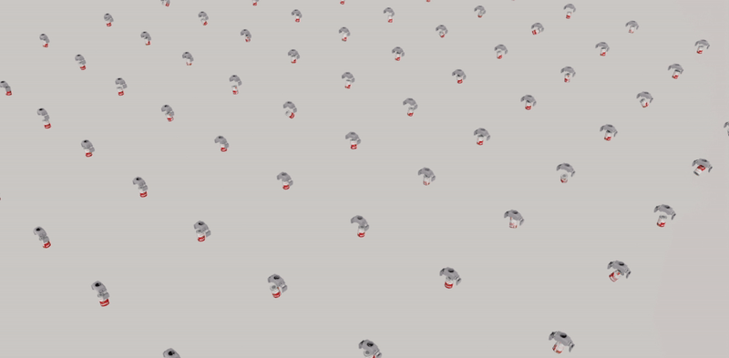
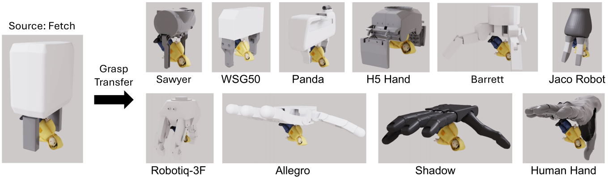
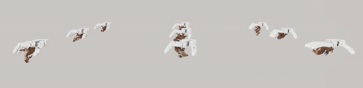

# MultiGripperGrasp Toolkit

Simulation based grasp filter. This repository contains a grasp filter developed using Isaac Sim, it provides the usage and visualization tools for the MultiGripperGrasp dataset.

**MultiGripperGrasp: A Dataset for Robotic Grasping from Parallel Jaw Grippers to Dexterous Hands**

Luis Felipe Casas Murrilo, Ninad Khargonkar, Balakrishnan Prabhakaran, Yu Xiang

[[paper](https://arxiv.org/pdf/2403.09841.pdf)] [[video](https://www.youtube.com/watch?v=pm1K6wbc830)] [[arXiv](https://arxiv.org/abs/2403.09841)] [[project site](https://irvlutd.github.io/MultiGripperGrasp)] [[dataset folder](https://utdallas.box.com/v/multi-gripper-grasp-data)]

### Citing MulitGripperGrasp Toolkit

Please cite MulitGripperGrasp Toolkit if it helps your research:

    @misc{murrilo2024multigrippergrasp,
      title={MultiGripperGrasp: A Dataset for Robotic Grasping from Parallel Jaw Grippers to Dexterous Hands}, 
      author={Luis Felipe Casas Murrilo and Ninad Khargonkar and Balakrishnan Prabhakaran and Yu Xiang},
      year={2024},
      eprint={2403.09841},
      archivePrefix={arXiv},
      primaryClass={cs.RO}
    }

### License

MultiGripperGrasp Toolkit is released under the [GNU General Public License v3.0](LICENSE).

### Contents
  - [Prerequisites](#prerequisites)
  - [Installation](#installation)
  - [Visualizing Dataset Samples](#visualizing-dataset-samples)
  - [Running the Simulation](#running-the-simulation)
    - [Parameters and Inputs](#parameters-and-inputs)
    - [Transferred Grasps](#transferred-grasps)
    - [Reproducing Paper Results](#reproducing-paper-results)
  - [More Documentation](#more-documentation)
    - [Helpful Links](#helpful-links)

## Prerequisites

This code was tested with Isaac Sim 2023.1.0 on Linux.

## Installation

1. Clone the repo:

    ```Shell
    git clone git@github.com:IRVLUTD/isaac_sim_grasping.git
    ```

2. Install the Isaac Sim 2023.1.0 and cd to its python directory:
   Follow the instructions in the [Isaac Sim Website](https://docs.omniverse.nvidia.com/isaacsim/latest/installation/install_workstation.html) for proper installation.
    Normally the python.sh is on the following directory:
    ```Shell
    cd ~/.local/share/ov/pkg/isaac_sim-2023.1.0
    ```

3. Install the required libraries using the Isaac Sim python environment:
   ```Shell
    ./python.sh -m pip install tqdm
    ```
    Note: Only tqdm must be installed, all other libraries should come with the Isaac Sim version.

4. Download the MultiGripperGrasp dataset and the object .usd models from the [dataset folder](https://utdallas.box.com/v/multi-gripper-grasp-data). Links can also be found at the end of this document.


## Visualizing Dataset Samples
To visualize the dataset a [visualization standalone](visualize_grasps.py) is included in the repository. The script must be ran with the Isaac Sim python.sh. The script requires the following parameters:

- json_dir: Grasp data directory (dataset .json folder). Note: the program does not read .json files within folders, therefore, a valid directory would be the Allegro folder within the dataset. 
- gripper_dir: Gripper directory (folder containing all the gripper .usd folders)
- objects_dir: Object directory (folder containing all the object .usd folders)
- num_w: Number of Workstations to run simultaneously (gripper, object pair) (default: 15)
- (Optional) ub: Upper bound to filter the grasps with (applied to fall time).
- (Optional) lb: Lower bound to filter the grasps with (applied to fall time).
- (Optional) transfer: Used for visualizing transfered grasps.
- (Optional) device: Specifies which gpu device to run Isaac Sim with.

Note: To run the simulation without warnings add the following parameters to the command: 
 ```Shell
 --/log/level=error --/log/fileLogLevel=error --/log/outputStreamLevel=error
 ```

Example command to run the visualization script:
``` Shell
./python.sh (repo directory)/visualize_grasps.py --json_dir=(dataset .json folder) --gripper_dir=(repo directory)/grippers --objects_dir=(object .usd folder) --num_w=10 --ub=3 --lb=0 --/log/level=error --/log/fileLogLevel=error --/log/outputStreamLevel=error
```
<p align="center">

</p>

## Running the Simulation
The simulation can use any gripper and object provided they are prepared correctly (See the documentation to add [grippers](docs/add_grippers.md) and [objects](docs/add_objects.md)). It loads the grasp information from the files specified and creates multiple "workstations" to test all the grasps. Then, it tries to perform the grasps with the specified control routines. When the object falls or the testing time is up, the time they took to fall is recorded and then saved to the output file. If any grasps is unable to touch the object, it will be recorded as a negative "fall time" value. Once the grasp test is completed, the workstation will reset and load a new grasp for testing. When all the grasps are finished, the output file is saved, the complete simulation will reset and a new file loaded. 
<p align="center">

</p>

### Important Files/Folders description
1) standalone.py: Graspit grasps standalone executable
2) transfer_st.py: Transfered grasps standalone executable
3) visualize_grasps.py: Standalone executable to visualize filtered grasps
4) views.py: Simulation's behavioral code
5) managers.py: Contains grasp information and the reporting of results for all the standalones
6) controllers.py: Developed gripper controllers
7) utils.py: General utility functions
8) grippers: Gripper .usd files


### Parameters and Inputs
A standalone executable for the graspit grasps ([standalone.py](standalone.py)) and for transferred grasps ([transfer_st.py](transfer_st.py)) are included within the repository. A sample command to run the graspit grasps is shown below along with the available options. Note: for Isaac Sim standalone executables, the commands must be run from the isaac sim python.sh directory.

The standalone.py takes as input:
- json_dir: Grasp data to filter directory (dataset .json folder). Note: the program does not read .json files within folders, therefore, a valid directory would be the Allegro folder within the dataset. 
- gripper_dir: Gripper directory (folder containing all the gripper .usd folder)
- objects_dir: Object directory (folder containing all the object .usd folder)
- output_dir: Output directory (directory to save the filtered grasps .json file)
- num_w: Number of Workstations to run simultaneously (object-gripper pair) (default: 150)
- test_time: Total test time for each grasp test (default:3).
- controller: Controller reference (within [controllers.py](controllers.py))(default: position)
- (Optional) print_results: Verbosity of standalone after finishing one .json file.
- (Optional) device: GPU device to use for Isaac Sim (default: 0)
- (Optional) headless: Run the simulation headless 

Note: To run the simulation without warnings add the following parameters to the command: 
```Shell
 --/log/level=error --/log/fileLogLevel=error --/log/outputStreamLevel=error
```

Sample run command:
```Shell
./python.sh (repo directory)/standalone.py --json_dir=(.json files folder) --gripper_dir=(repo directory)/grippers --objects_dir=(object .usd folder) --output_dir=(output directory) --num_w=100 --test_time=3 --controller=position --headless --print_results --/log/level=error --/log/fileLogLevel=error --/log/outputStreamLevel=error
```
<p align="center">

</p>

### Transferred Grasps
The grasp filter is able to evaluate the object fall-off time for a large amount of generated grasps. The successful grasps of one gripper can represent successful grasps in others and increase the overall amount of successful grasps in the dataset. To test this hypothesis, we implemented the grasp transfer of successful grasps from one gripper to others and evaluated the transferred grasps using antoher Isaac Sim standalone ([transfer_st.py](transfer_st.py)).

We utilize an alignment between grippers to transfer grasps, which used a common notion of gripper pose (translation and orientation). The translation refers to the palm center of the gripper, and the orientation is with respect to a canonical pose of the gripper palm pointing in a fixed direction. Thus, any grasp pose from a gripper was transferred to another by using this pose alignment. We first transform a source gripper pose to its aligned pose, and then transform the aligned pose to the target gripper.

<p align="center">

</p>


The transfer_st.py takes as input:
- json_dir: Grasp data to filter directory (dataset .json file folder). Note: the program does not read .json files within folders, therefore, a valid directory would be the Allegro folder within the dataset. 
- gripper_dir: Gripper directory (folder containing all the gripper .usd folders)
- objects_dir: Object directory (folder containing all the object .usd folders)
- output_dir: Output directory (directory to save the filtered grasps .json file)
- num_w: Number of Workstations to run simultaneously (object-gripper pair) (default: 150)
- test_time: Total test time for each grasp test (default:3).
- controller: Controller reference (within [controllers.py](controllers.py)) (default: transfer_default)
- (Optional) print_results: Verbosity of standalone after finishing one .json file.
- (Optional) device: GPU device to use for Isaac Sim (default: 0)
- (Optional) headless: Run the simulation headless 

Note: To run the simulation without warnings add the following parameters to the command: 
```Shell
 --/log/level=error --/log/fileLogLevel=error --/log/outputStreamLevel=error
```

Sample run command:
```Shell
./python.sh (repo directory)/transfer_st.py --json_dir=(.json files folder) --gripper_dir=(repo directory)/grippers --objects_dir=(object .usd folder) --output_dir=(output directory) --num_w=100 --test_time=3 --headless --print_results --/log/level=error --/log/fileLogLevel=error --/log/outputStreamLevel=error
```

<p align="center">

</p>

### Reproducing Paper Results
As of this version, the simulation uses a specific .json structure. The [managers.py](managers.py) file is the responsible for reading and transforming the relevant grasp information to the format used by the program. The information is:
- The gripper name: Must be exactly the name with which the gripper is saved within the gripper directory.
- The object name: Must be exactly the name with which the object is saved within the object directory.
- Grasp pose data: 7 dimensional vector containing the gripper and object relative pose. (0-2 denotes the postion, 3-6 denotes the quaternion). Must be changed to the Isaac Sim quaternion convention (w, x, y, z)
- Joint Value Data: vector containing the Degree of Freedom (DoF) information of the grasps. 

https://github.com/IRVLUTD/isaac_sim_grasping/blob/f3a0685a1ed10741ff9768656f0de1dcf065f2f4/managers.py#L21-L46

Within the [managers.py](managers.py) you can find the hyperparameters used for filtering the grasps of each gripper. In order to reproduce the paper results, one must run the filter with the same hyperparameters:

https://github.com/IRVLUTD/isaac_sim_grasping/blob/f3a0685a1ed10741ff9768656f0de1dcf065f2f4/managers.py#L67-L153

All the files provided within this repository and in the [[dataset folder](https://utdallas.box.com/v/multi-gripper-grasp-data)] are set up for use out of the box. To reproduce the results you will need to run the simulation on the dataset and save to a different folder (output_dir). This will override the fall_time values and save the latest results on the new file with the relevant information: grasp pose information, grasp dof information, test type, total test time, fall time. Below is the corresponding manager.save_json function:

https://github.com/IRVLUTD/isaac_sim_grasping/blob/a7207a100e0940b5103bb407ad0676c5771c0a83/managers.py#L246-L277

Note: To reproduce the transferred grasp results the same must be done with the transfer manager class [T_manager](https://github.com/IRVLUTD/isaac_sim_grasping/blob/b6b72b51359c6d2c0fb128f2921097f3716aba0b/managers.py#L300). 

## More Documentation
- [Adding a new Gripper](docs/add_grippers.md)
- [Adding a new Object](docs/add_objects.md)
- [Available Gripper Controllers](docs/controllers.md)

### Helpful Links
- MultiGripperGrasp Shared Folder [here](https://utdallas.box.com/v/multi-gripper-grasp-data)
- Google Scanned Objects and YCB objects .usd files [here](https://utdallas.box.com/s/bfc81l7ypaaa3s0niaz1miylbdgul7b7)
- Filtered GraspIt Grasps Dataset [here](https://utdallas.box.com/shared/static/cvrr97gylkonno7hokmyn80k36u9ts7f.zip)
- Transferred Grasps Dataset [here](https://utdallas.box.com/shared/static/vtanakqjqqet61s3doxu9196vg6tjxs9.zip)
- Isaac Sim Manual: https://docs.omniverse.nvidia.com/isaacsim/latest/overview.html
- Helpful code for python standalones (code snippet samples): https://docs.omniverse.nvidia.com/isaacsim/latest/reference_python_snippets.html
- Installing Packages for use with isaac sim python.sh: https://docs.omniverse.nvidia.com/isaacsim/latest/installation/install_python.html

### Notes
- Deactivate conda if you have an active environment, it may cause some errors when running isaac sim.
- Always use complete paths for the directories, errors may occur otherwise.
