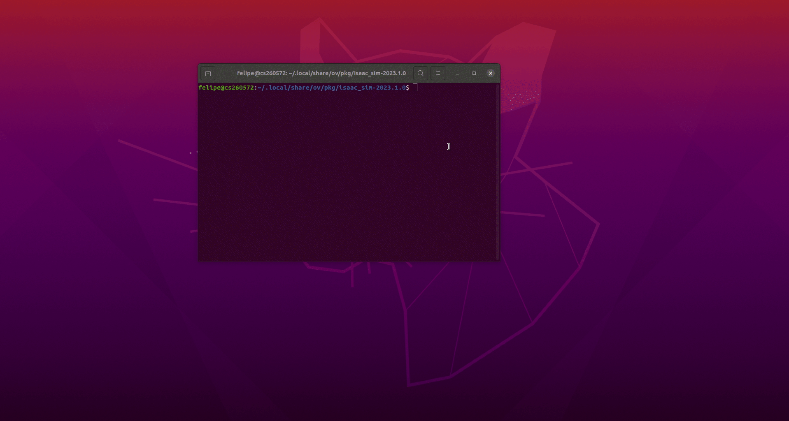
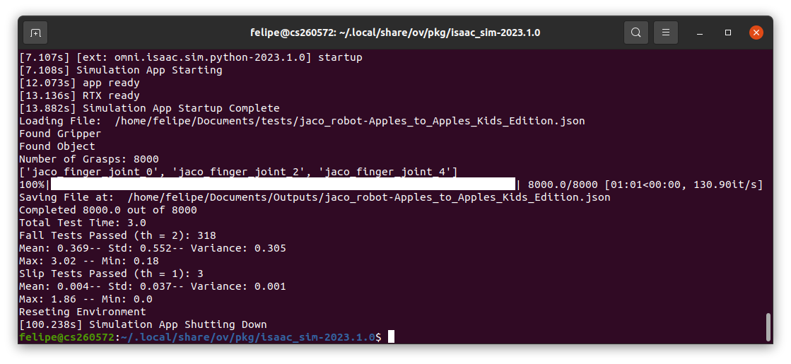

# isaac_sim_grasping

Simulation based grasp filter. This repository contains a grasp filter developed using Isaac Sim, it has the objective of testing generated grasps for a large amount of objects and grippers. In our case, the grasps tested were generated using GraspIt. These grasps were found to be of varied quality; upon close inspection many grasps could easily be classified as promising grasps or failed grasps. Consequently, this simulation was developed to generate different metrics with which the grasps can be evaluated and filtered, thus providing a large dataset of tested grasps that could be used for different purposes. The grasp information generated by GraspIt consists of the relative pose between the object and gripper, as well as the Degree of Freedom (DoF) information of the gripper. 
   
## Simulation Behavior
The simulation can use any gripper and object provided they are prepared correctly (See the documentation to add grippers and objects). It loads the grasp information from the files specified and creates multiple "workstations" to test all the grasps. Then, it tries to perform the grasps with the specified control routines. When the object falls or the testing time is up, the time they took to fall is recorded and then saved to the output file. If any grasps is unable to touch the object, it will be recorded as a negative "fall time" value. Additionally, a "slip time" metric was implemented by calculating the moment the object begins to slip from the grasp of the gripper. Once the grasp test is completed, the workstation will reset and load a new grasp for testing. When all the grasps are finished, the output file is saved, the complete simulation will reset and a new file loaded.

### Important Files/Folders description
1) standalone.py: standalone executable
2) views.py: Simulation's behavioral code.
3) manager.py: contains grasp information and the reporting of results
4) controllers.py: Programmed gripper controllers to test with
5) utils.py: general utility functions
6) Helpful Scripts: Scripts found to be useful when developing simulations in Isaac Sim
7) grippers: gripper .usd files

## Parameters and Inputs
A standalone executable (standalone.py file) for the simulation is within the repository; a command to run the simulation is shown below. Note: for Isaac Sim standalone executables, the commands must be run from the isaac sim python.sh directory. For this simulation Isaac Sim 2023.1.0 was used. Sample running command:

./python.sh (standalone folder)/standalone.py --json_dir=(json folder)/obj8 --gripper_dir=(repo directory)/grippers --objects_dir=(object directory) --output_dir=(output directory) --num_w=300 --test_time=6 --controller=position --headless --print_results

The standalone.py takes as input:
- json_dir: grasp data directory (.json file)
- gripper_dir: gripper directory (folder containing all the gripper .usd files)
- objects_dir: object directory (folder containing all the object .usd files)
- output_dir: output directory (directory to save the outputed .json file)
- num_w: Number of Workstations to run the simulation with (gripper, object pair) (default: 150)
- test_time: total test time for each grasp test (default:6).
- controller: controller reference (within controllers.py)
- (Optional) print_results: Verbosity of standalone after finishing one .json file.
- (Optional) headless: Run the simulation headless

Note: To run the simulation without warnings add the following parameters to the command: 
 --/log/level=error --/log/fileLogLevel=error --/log/outputStreamLevel=error

### Running the Simulation
As of this version the simulation uses a specific .json structure an example is available at [sample.json](sample.json). Nonetheless, it can be easily adapted to use a different. The [manager.py](manager.py) file is the responsible for reading and transforming the relevant grasp information to the format used by the program. The information is:
- The gripper name: Must be exactly the name with which the gripper is saved within the gripper directory.
- The object name: Must be exactly the name with which the object is saved within the object directory.
https://github.com/IRVLUTD/isaac_sim_grasping/blob/4d1695831defc6b71d90b0ea6d7a1d03f34c1346/manager.py#L26-L28
- Grasp pose data: 7 dimensional vector containing the gripper and object relative pose. (0-2 denotes the postion, 3-6 denotes the quaternion). Must be changed to the Isaac Sim quaternion convention (w, x, y, z)
- DoF Data: vector containing the DoF information of the grasps. Note: the order of the DoF may change from software to software, a "translation" may be needed to ensure that the grasps are loaded correctly.
https://github.com/IRVLUTD/isaac_sim_grasping/blob/4d1695831defc6b71d90b0ea6d7a1d03f34c1346/manager.py#L30-L41

#### Running with Head
To run the simulation headless the "--headless" option must be omitted from the running command. This mode is generally used to visualize the correct behavior of the simulation, be sure to reduce the amount of workstations in the simulation; it may ease inspection. Furthermore, with Isaac Sim 2023.1.0 the standalones launch without any default lighting, you can easily turn it off after the simulation set up. 

#### Running Headless
Alternatively, the simulation can be ran on headless mode, which would speed up testing considerably. 

Both modes include a progression bar that offers realtime information about the simulation (the amount of grasps completed). Futhermore, if the "--print_results" option was selected when running the standalone after the grasps are completed, statistical information is offered about the grasps testes, i.e minimum and maximum fall time and slip time recorded.

### Output File
The results of the tests are stored in a new .json file with the relevant information: grasp pose information, grasp dof information, test type, total test time, fall time and slip time. Below is the corresponding manager.save_json function:

https://github.com/IRVLUTD/isaac_sim_grasping/blob/14585b9e2868345c8d28c72b3d9743ce9c4d91ae/manager.py#L298-L314

### More Documentation
- [Adding a new Gripper](docs/add_grippers.md)
- [Adding a new Object](docs/add_objects.md)
- [Available Gripper Controllers](docs/create_new_controller.md)

### Helpful Links
- Isaac Sim Manual: https://docs.omniverse.nvidia.com/isaacsim/latest/overview.html
- Helpful code for python standalones (code snippet samples): https://docs.omniverse.nvidia.com/isaacsim/latest/reference_python_snippets.html
- Installing Packages for use with isaac sim python.sh: https://docs.omniverse.nvidia.com/isaacsim/latest/installation/install_python.html

### Notes: 
- Deactivate conda if you have an active environment, it may cause some errors when running isaac sim.
- Always use complete paths for the directories, errors may occur otherwise
- The simulation supports a specific .json file format, to change or add compatibility to other formats the manager class within manager.py must be editted.
- Many Isaac Sim API functions were found to give the incorrect data when called, if errors arise when implementing new code beware of this.

### Known Issues
- A segmentation fault rarely occurs performing the tests in multiple .json files. If the simulation is reseted the files should run correctly.
- python @args error when running on remote PC: This is a known Isaac Sim error, for more information visit the Isaac Sim forums and/or documentation.
