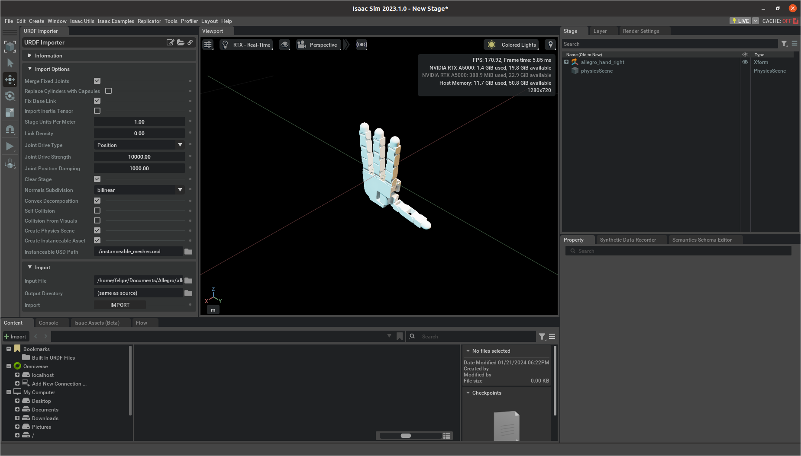
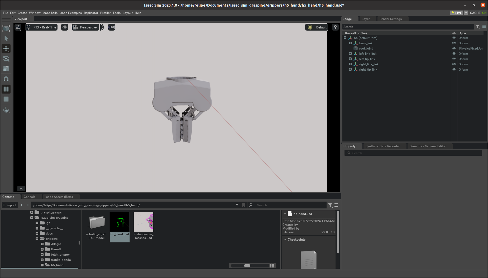
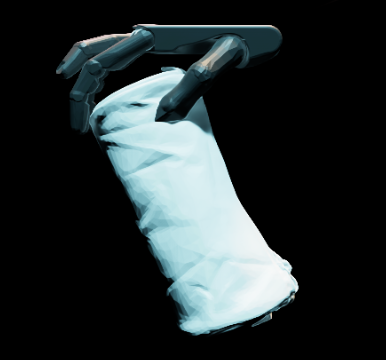

# Importing a new Gripper
To get a new gripper into Isaac Sim, import it via the GUI and save it as a `.usd` file in your gripper directory. Follow the same format as the grippers in the repository [gripper directory](../grippers). Make sure your `.usd` grippers are tested and ready for simulation. For quicker setup, use the GUI example from [Isaac Sim Manual](https://docs.omniverse.nvidia.com/isaacsim/latest/core_api_tutorials/tutorial_core_hello_world.html).

## Steps to Add grippers:
1) **Prepare the .usd File**: Import your gripper into Isaac Sim, ensuring it has the right attributes like max efforts, joint velocities, and colliders. Convert `.urdf` files using Isaac Utils > Workflows > URDF Importer.

2) **(Recommended)** Use the Isaac Sim GUI to ensure the gripper moves as intended. 

3) **Update Gripper Information**: Add your gripper's details to the [gripper_isaac_info.json](../grippers/gripper_isaac_info.json) file. Each gripper needs a unique ID matching the .json grasp files:

    "**EF_axis**": Indicates which direction (x, y, or z) the gripper's palm faces (values are +/- 1, 2, 3).

    "**physics_frequency**": The frequency for PhysiX engine evaluations during grasp tests.

    "**contact_names**": Names of joints to monitor for contact; must match `.usd` model exactly.

    "**contact_th**": Number of contacts needed to classify a grasp as successful.

    "**opened_dofs**": Degrees of Freedom (DoF) values (or joint values) when the gripper is fully open.

    "**palm_pose**": A reference pose for transferring grasps from the MGG dataset, represented as (x,y,z,qw,qx,qy,qz). For more on grasp transfer, see the [paper](https://arxiv.org/pdf/2403.09841.pdf).

4) Verify in Simulation: Run a simulation with your new gripper to confirm functionality. Lower the number of workstations to streamline testing. Remember, new gripper folders should match the path structure in the repository: `grippers/gripper_ID/gripper_ID/gripper_ID.usd`

