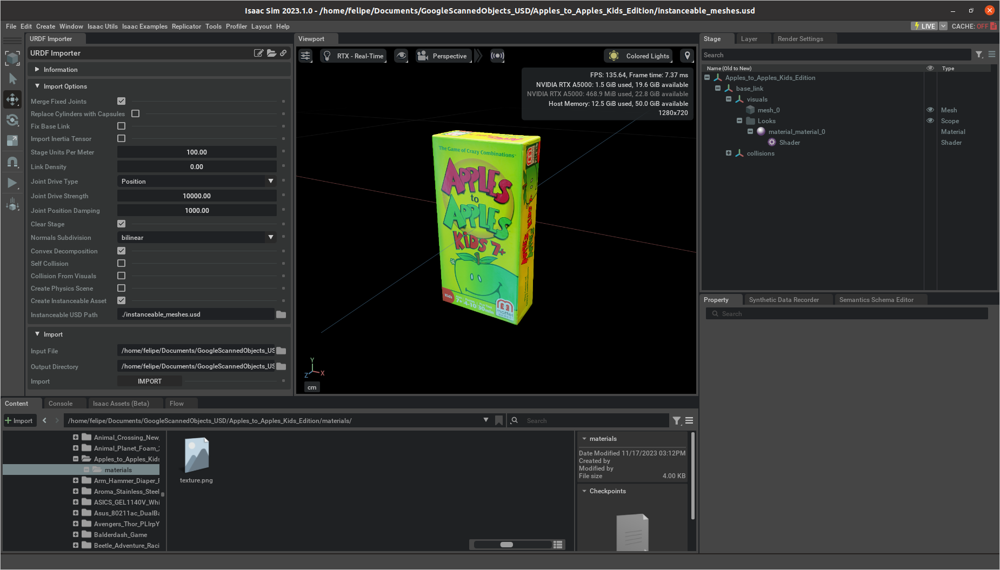

# Importing a new Objects
To add a new object to Isaac Sim, use the GUI to import it and save as a `.usd` file. Refer to the [Isaac Sim manual](https://docs.omniverse.nvidia.com/isaacsim/latest/overview.html) for more information about the supported formats. 

## Steps to Add objects:
1) **Import and Save:** import the Object and save as `.usd`. Preferably using instanceable meshes for memory efficiency.

2) **Check Object Attributes:** Ensure the object's properties like colliders, mass, and density are set correctly.
   
3) **Test Collider Visualization:** Run a simulation to see how the object's collider behaves.

4) **Save to Objects Directory:** Save the `.usd` to the objects directory. The standalone checks for the objects .usd files within a directory with a specific structure: `objects/object_ID/object_ID.usd`

Note: When moving .usd files between different computers, absolute paths in the .usd (like for albedo maps) might break. Use relative paths to keep things working across systems.
