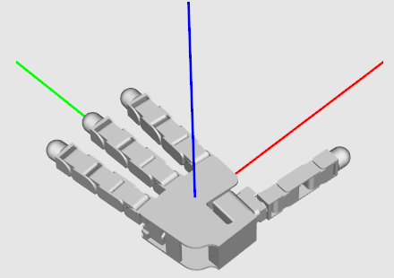
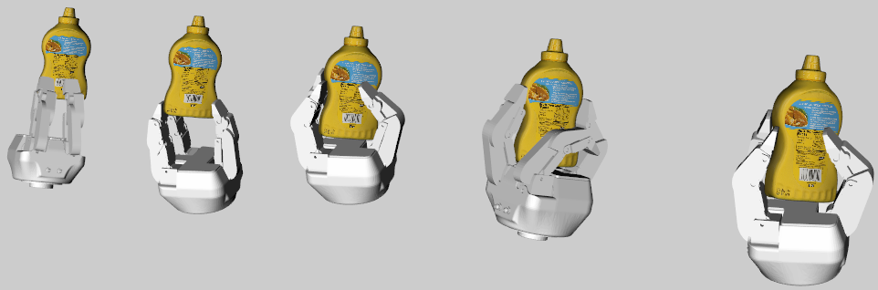

# Grasp Visualization with `Optas`

- [Grasp Visualization with `Optas`](#grasp-visualization-with-optas)
  - [Usage](#usage)
    - [Data](#data)
    - [Scripts](#scripts)
  - [Requirements](#requirements)

Some additional source code for grasp vizualization withouth the Isaac Sim dependency. The existing `optas` libarary is used to visualize the grasps and object models. This might be helpful to quickly debug some grasp files and check for errors. Feel free to modify the source as needed to get a suitable figure!

## Usage

### Data
You'll require the following data files in order to viz the grasps

- Isaac filtered grasps extracted to a folder. See zips under `DATASET_ROOT/graspit_grasps/` (even though the name says graspit, it has the filter grasp info!)

- Object 3D Model `.obj` files. See zips under `DATASET_ROOT/Object_Models/`

- The gripper files are already included with the repository

### Scripts

> Visualize the grippers individually in the common pose-aligned space with axes: 
- `python vis_gripper.py [-g GRIPPER_NAME]`

 

> Visualize some grasps from a single pair of (gripper, object):
- `python vis_single_pair.py [--model_dir MODEL_DIR] [-f FILTERED_JSON_DIR] [--gripper GRIPPER_NAME] [--model MODEL_NAME]`

 

> Visualize all grippers with some selected number of grasps. Change the (gripper, model) pairs to see different combinations.
- `python vis_all_grippers.py [--model_dir MODEL_DIR] [-f FILTERED_JSON_DIR]`

 

## Requirements
- Tested with `python 3.8`
- `optas`([GitHub Repo](https://github.com/cmower/optas))
  - Included version of `optas` has a dependency on `open3d` (newer versions might not have this as a benefit!)
- See included `requirements.txt` for all other deps.
  - Install using: `pip install -r requirements.txt`